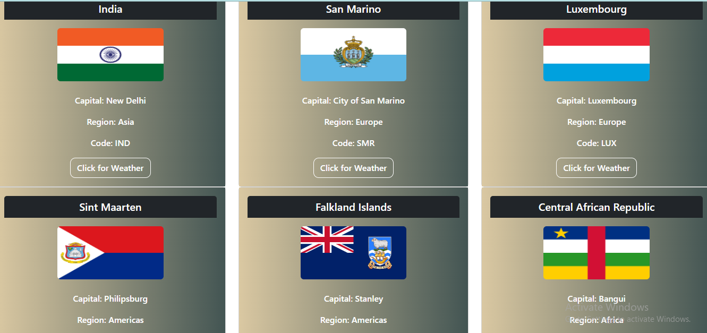

## Async programming- Day -2: Promise 

**Restcountries & Weather using fetch API**   

 - I have completed and submitted Restcountries & Weather using fetch API task, kindly check and verify it.  

 - I used HTML, CSS, Bootstrap and JS in this task   

  - HTML file is [index.html](index.html)

  - JS file is [script.js](src/script.js)

  **Task URL:** https://checkweatherincountries.netlify.app

   - I have attached `Output image` for your reference  

   **Output:**

 

